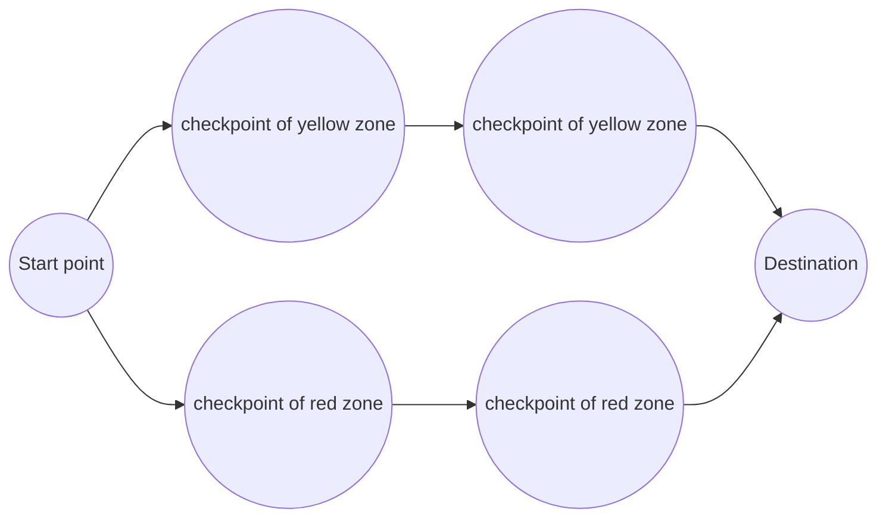

# AAE2004_t1_GP8 Look gooood
<p align='center'>
<image src=images/Group_8_Banner.gif alt="Group 8 Banner">
</p>


<!-- TABLE OF CONTenT-->
<details open='open'>
  <summary><h2 style='display: inline-block'>Table of Content</h2></summary>
  <ol>
    <li>
      <a href='#1--background-of-path-planing-to-aviation-engineering'>Background of Path Planning to Aviation Engeering</a>
    </li>
    <li><a href='#2--theory-of-path-planning-algorithm'>Theory of Path Planning Algorithm</a>
    </li>
    <li><a href='#3--introduction-of-the-engineering-tools'>Introduction of the Engeering Tools</a>
    </li>
    <li>
      <a href='#4--task-1'>Task 1</a>
    </li>
    <li>
      <a href='#5--task-2'>Task 2</a>
    </li>
    <li>
      <a href='#6--task-3'>Task 3</a>
    </li>
    <li><a href='#7--additional-task-1'>Additional Task 1</a>
    </li>
    <li><a href='#8--additional-task-2'>Additional Task 2</a>
    </li>
    <li><a href='#9--reflective-essay'>Reflective Essay</a>
    </li>
    <li><a href='#10--references'>References</a></li>
    <li>
      <a href='#useful-source'>Useful source</a>
    </li>
    <li>
      <a href='#progess'>Task on progess</a>
    </li>
  </ol>
</details>

<!-- REPORT CONTACT-->


# **1 | Background of Path Planing to Aviation Engineering**


<p>
  &nbsp;&nbsp;&nbsp;&nbsp;In Aviation Industry, Path Planning has a importance place in Air Traffic Control, Airline Companies and Airports. ...
  <br>
  &nbsp;&nbsp;&nbsp;&nbsp;For Air Traffic Control,by calculating obstical and danger zone, Path Planning help operater adjust the flight route of aircrafts, in order to provide a safety flying experience. ...
  <br>
  &nbsp;&nbsp;&nbsp;&nbsp;For Airline Companies, by calculating the shortest route for airlines, Path Planning help companies reduce filght cost, in order to enhance their profit. ...
  <br>
  &nbsp;&nbsp;&nbsp;&nbsp;For Airports, by planning the take off and landing timing, Path Planning help Airports maximize the aircraft flow, in order to increase passenger flow. ...

  <br>
</p>

# **2 | Theory of Path Planning Algorithm**


&nbsp;&nbsp;&nbsp;&nbsp;Converting a maze problem into a grid format, A-Star algorithm will assign a weight value which repersent the traveling cost on each coordinates. By calculating the lowest traveling cost between start point and end point, a shortest path can be collected.
<br>
Example for a maze problem is fitted into a grid format.

<table align='center'>
  <tr>
    <th>Maze Problem</th>
    <th>Grid Format</th>
  </tr>
  <tr>
    <td>
    <image src='images/Raw_sample.png'>
    </td>
    <td>
      <image src='images/Sample.png' alt='how is work'>
    </td>
  </tr>
</table>
&nbsp;&nbsp;&nbsp;&nbsp;In grid format, all possabale path position are recognized as node, and can be assigned a weight to show the traveling cost, which show as follows.
<br><br>
<b>Step 1</b>, calculate the traveling cost form start point to its adjacent and diagonal notes. Then base on each node, calculate heuristic estimated cost, the displacement, between itself and end point. After combine the traveling cost and heuristic estimated cost, a weight of the node can be obtainted.The data are stored in a list of possable step.<br><br>
<b>Step 2</b>, select the lowest weight node from the list as repersenting the position of the <b>first</b> step apporaching to the End Point. Then append it to a list which recorded evey step it moved to.
<br><br>
<b>Step 3</b>, repeat Step 1 and Step 2 untill it reaches the End point, A list of the movement can be obtained.
<br><br>
<b>Step 4</b>, Track back from the list of movement, a route of shortest path can be viewed.<br><br>
<table align='center'>
  <tr>Diagram of above steps:</tr>
  <tr>
    <td><image src='images/2_step1.png'></td>
    <td><image src='images/2_step2.png'></td>
    <td><image src='images/2_step_3&4.png'></td>
    <td><image src='images/Theory_example.gif'></td>
  </tr>
</table>

Flowchart for A-Star algorithm:<br> 


# **3 | Introduction of the Engineering Tools**

## **A. Python & Html**
&nbsp;&nbsp;&nbsp;&nbsp;Both Python and Html are computer langue which is easy to learn and having a large flexibility. Moreover, Python has diverse of modpack, In this project we uesd Matplotlib and Imageio for graphing and photo operating. 
## **B. Visual Studio Code**
&nbsp;&nbsp;&nbsp;&nbsp;Visual Studio Code(VS Code), is a platform fo source code editing, it covers many useful features, such as debugging, syntax highlighting, intelligent code completion, snippets, code refactoring, and embedded Git. Ferthermore, estension can be install for  additional functionality
## **C. GitHub**
&nbsp;&nbsp;&nbsp;&nbsp;GitHub is a free online platform, for programmer hosting and cooperatiing softwre developmentd. It is not only used to host open source software development projects, but also hold variety of event for instan Game Off.
<!-- TASK 1 -->
# **4 | Task 1**

## a. Methodology
<ol type='I'>
<h3><li>Information</li></h3>
<dd>&nbsp;&nbsp;&nbsp;&nbsp;Although most of the fights do not always follow the same route, it is important for airlines to find the shortest route to reach their destination as it not only saves time but also saves money by decreasing fuel consumption. Additionally, the most efficient aircraft model is selected based on the route that helps minimize the flight cost. In this task, we are going to find the best aircraft models with minimum cost for the shortest route found for the given challenge keeping the needs of passsengers in mind.
<br><br></dd>

<h3><li>Data for task 1</li></h3></ol><dd>
<table align='center'>
  <tr>
    <td>Our map</td>
    <td>Our map in grid format</td>
  </tr>
  <tr>
    <td><image src='images/map.png'width=100%></td>
    <td><image src='images/Map_in_grid.png'width=1500></td>
  </tr>
</table>

<h3>&nbsp;&nbsp;&nbsp;&nbsp;Cost Speciffication</h3>
&nbsp;&nbsp;&nbsp;&nbsp;More cost will be calculated when travelling in the cost intensive area. Extra 20% in Fuel cost intensive area and 40% for Time cost intsnsive area.

| key | A321neo | A330-900neo | A350-900|
| :---: | :---: | :---: | :---: |
|Fuel Consumption rate(kg/min)|54|84|90|
|Passenger Capacity|200|300|350|
|Time cost (Low)($/min)|10|15|20|
|Time cost (Medium)($/min)|15|21|27|
|Time cost (High)($/min)|20|27|34|
|Fixed Cost($)|1800|2000|2500|

<br><h3>&nbsp;&nbsp;&nbsp;&nbsp;Trip cost equation</h3>

$Cost=C_{Fuel} \cdot \Delta F \cdot T_{best} +C_{Time}\cdot T_{best}+C_{Fixed}$

<br>

$C_{fuel}$: fuel cost<br>
$\Delta F$: consumed fuel<br>
$T_{best}$: traveling time (mins)<br>
$C_{Time}$: time cost<br>
$C_{Fixed}$: fixed cost <br>

<h3>Detail of each scenarios</h3>

### &nbsp;&nbsp;&nbsp;&nbsp;Scenario 1
1. 3000 Passengers  with in this week
2. 12 flights maximum per week
3. Time cost = medium and Fuel cost = 0.76$/kg

### &nbsp;&nbsp;&nbsp;&nbsp;Scenario 2 
1. 1250 Passengers  with in this month
2. 5 flights maximum per week
3. Time cost = high and Fuel cost = 0.88$/kg

### &nbsp;&nbsp;&nbsp;&nbsp;Scenario 3
1. 2500 Passengers  with in this week
2. 25 flights maximum per week
3. Time cost = low and Fuel cost = 0.95$/kg

</dd>
<br>
<ol type='I' start=3>
<h3><li>Procedure</li></h3><dd>
&nbsp;&nbsp;&nbsp;&nbsp;The task objective is to find the flight cost for each aircraft in our <b>Map</b>. Then, compare and select the best aircraft models which has minimum cost and with in the limitation.<br><br>
&nbsp;&nbsp;&nbsp;&nbsp;First, create a coresponding obstacle and cost intensive area map in grid format.<br><br>
&nbsp;&nbsp;&nbsp;&nbsp;Second, by applying the map in to A-Star algorithm and starting path planning, a best route with the lowest travelling cost is collected.<br><br>
&nbsp;&nbsp;&nbsp;&nbsp;Third, according to each scenriao, calculate the total cost for 3 different aircrafts.<br><br>
&nbsp;&nbsp;&nbsp;&nbsp;Finally, compare and select an aircraft model that has the lowest travelling cost while satisfying the scenriao.<br>
</dd>
</ol>

## b. Results

<p align='center'>
<image src='images/Task_1_Scenario_1.gif'><br>
&nbsp;&nbsp;&nbsp;&nbsp;By using the given formula, the cost of the trip can be calculated without any difficulty and according to it, A330-900neo has the lowest trip cost for scenario 1. Additionally, for both scenario 2 and 3, the aircraft model with the lowest trip cost is A350-900.

The blue star represents the start node while the green star represents the end node or the goal node. An aircraft travelling from the start node to the goal node might follow a more convenient route keeping the fuel and time-consuming area in mind to lower the total trip cost. And this route for the given challenge is presented by the red line starting from the start node and ending at the goal node.

</p>

## c. Discussion

<p align='center'>
 
  &nbsp;&nbsp;&nbsp;&nbsp;As mentioned above,one of the main goal of finding the shortest route for the aircraft is saving the travel time.Aircraft has a uncompetitive speed advantage to the another kind of transportation method.This is the reason why do the aviation activity are so important to the transportation system of the world.Besides improving the convience and the efficency of the aviation activity,finding the shorest route has the meaning on fulfilling the special requirements of the passengers Expectally for the passengers or cargo which need to travel internationally as fast as possible,it include animals like horse,rhino and other kind of big animals.As you can see,this is one of the related point between this task and the aviation. 
  
  &nbsp;&nbsp;&nbsp;&nbsp;For another,taking the shorest route means it take the shorest travel time.It means the aircraft will provide lesser pollutant to the environment.Because taking the aircraft is the most carbon emission activity in the world,the offical and private aviation organisations like ICAO and IATA always demand the airline to lower the amount of carbon emission.And this is the way to acheive that goal.As you can see,this is the another related point between the task and aviation.
  
  &nbsp;&nbsp;&nbsp;&nbsp;In conclusion, task 1 is able to achieve both passengers’ needs and environment protection. For passengers, they will have different kinds of requirements while choosing air flight for travelling such as price, duration and coziness etc. Besides, passengers will be more likely to choose airline with a higher reputation. Therefore, task 1 can help passengers of selecting the most suitable travelling route as well as meet their needs. Moreover, fuels which are use in aviation industry cause harm to our environment. Since carbon dioxide emitted in the aircrafts may enhance the greenhouse effect. However, different type of aircraft have their unique design while the consumption of fuel and time in the same route will be different too. As a result, the results of task 1 are needed to maintain a high quality level of environment.
</p>


<!-- Task 2 -->
# **5 | Task 2**
## a. Methodology
<ol type='I'>
<h3><li>Information</h3>
<dd>&nbsp;&nbsp;&nbsp;&nbsp;During path planing, we need to take many variables in count, not only aircraft mode, but also the environment. In reallife there are certain area called Jet Steam Area, where aircrafts could consume reltively less fuel and redust traveling cost. In this task, we are going to recreate a Jet Steam area with a situation that could benefit our flight route the most.
</dd>&nbsp;</li>

<h3><li>Data for Task 2</h3>
<ul>
  The situation:
  <li>Use Task 1 of scenario 1 as the background</li>
  <li>Find a best place for seting the Jet Steam Area</li>
  <li>Cost along the Jet Steam Area is reduced by 5%</li>
  <li>The area of the Jet Steam must span across the map laterally and span 5-unit length vertically
</ul>
  <table align='center'>
  <tr><td>Our original map</td><td>Our map with Jet Steam area</td></tr>
  <tr>
    <td><image src='images/map.png'width=100%></td>
    <td><image src='images/Task_2_map.png'width=100%></td>
  </tr>
  </table>
</li>
<h3><li>Procedure</h3>
&nbsp;&nbsp;&nbsp;&nbsp;There are 2 major part in our apporach, 'Finding the best place of jet steam area' and 'Cost calculation' .
<h3>1. Finding the best place of jet steam area
</h3>&nbsp;&nbsp;&nbsp;&nbsp;To maximize the effect of jet steam area, we need to find a section(5 continuous y-coordinates) that covered by most of the flight route. 
<h3>2. Cost calculation</h3>&nbsp;&nbsp;&nbsp;&nbsp;A new cost intensive area which decrease 5% cost should be added in the input data. As this task shar the same background of task 1 scenario 1, the calculation for trivaling cost can refre to task 1 scenario 1.

</li>
</ol>

## b. Results
<ol type='1'>
<h3><li>Jet Stream Area</h3><dd>
&nbsp;&nbsp;&nbsp;&nbsp;We have discovered that the flight route passes most in the region between y&nbsp;=&nbsp;9 to y&nbsp;=&nbsp;14. As a result, we decided to set the jet stream area this region and therefore the flight route is the most cost-effective.
<br><p align='centre'>
<image src='images/Prove_jetSteam_area.png'></p>


<h3><li>Cost Calcution</h3><dd>
&nbsp;&nbsp;&nbsp;&nbsp;A330-900neo has the lowest Trip Cost among the 3 airplanes. Base on Trip Cost Equation, data is collected as follows.
<br></ol>

| Airplane Model |    $\Delta F$  |$T_{best}$ |  $C_{C}$ |  $C_{T}$   |  $C_{F}$ | Number of trip required  |   Total Trip Cost  |
| :--------         | :------- | :------- |:---------  | :--------- |:--------   | :--------| :--------|
| A321neo | 54kg/min        | 75.0059487247684 /min  | 1800  $/flight   |  15  $/min        | 0.76  $/kg         | 15   | $90050 |
| A330-900neo |  84kg/min        | 75.0059487247684    min| 2000   $/flight       |  21  $/min        | 0.88 $/kg          | 10   | $83635 |                
| A350-900 |  90kg/min        | 75.0059487247684   min  | 2500  $/flight    |  27  $/min        | 0.95  $/kg | 9   | $86900 |              


## c. Discussion

<p align='center'>

Sometimes we can borrow thw power from the environment to help us to acheive our goal or even finish it in a higher efficency which includes the aviation activity.For example,using the wind power brings a higher speed than manpower for a ship in the past.Those kind od advantage can be seen more clearly in the jet stream area,If the aircraft fly through those area,it brings a clear effect on lower the operatiing cost .For example,there is a stronger wind power inside the jet stream area which provide a stronger lifting force for the aircraft,and the aircraft will be able to lower it's thrust and reducing it's fuel cost.As you can see,this is one of the related point between this task and he aviation.
</p>


<!-- Task 3 -->

# **6 | Task 3**
## a. Methodology
 
<ol type='I'>
<h3><li>Information</h3>
<dd>&nbsp;&nbsp;&nbsp;&nbsp;Human invent tools to help them overcome obsticals, as same as aviation industry. In real life, aircraft are designed based on industry needs. In the task, we are going to deesign a new air craft by finding out its parameters based on the restrictions.</dd>&nbsp;</li>
<h3><li>Data for task 3</h3>
<ul> Ruel and Restrictions:
  <li>design a new aircraft to best fit Task 1 Scenario 1</li>
  <li>Onlr consider cruise time of flight </li>
  <li>Also design the passenger capacity of the aircraft<br>(for each 50 passenger (min 100, max 450) increase time cost by 2 $/min (base time cost is 12 $/min))</li>
  <li>The base design is a twin-engine aircraft, if capacity>=300, you must switch to a 4-engine aircraft</li>
  <li>C<sub>c</sub> = 2000 for twin-engine, 2500 for 4-engine aircrafts</li>
  <li>Each engine consumes fuel at 20 kg/min</li>
  <li>Follow the trip cost equation and material cost list</li>
</ul>


| Airplane Capacity& Model |    $\Delta F$  |$T_{best}$ |  $C_{C}$ |  $C_{T}$   |  $C_{F}$ | Number of trip required  |   Total cost  |
| :--------         | :------- | :------- |:---------  | :--------- |:--------   | :--------| :--------|
| (Model 1) 250 | 40kg/min        | 77.1837664107356 /min  | 2000  $/flight   |  22  $/min        | 0.8823  $/kg         | 12   | $77064 |
| (Model 2) 300|  80kg/min        | 77.1837664107356    min| 2500   $/flight       |  24  $/min        | 0.8823 $/kg          | 10   | $98003 |                
| (Model 3) 450|  80kg/min        | 77.1837664107356   min  | 2500  $/flight    |  30  $/min        | 0.8823  $/kg | 7    | $71844 |              

<h3>&nbsp;&nbsp;&nbsp;&nbsp;Trip cost equation</h3>
$Cost=C_{Fuel} \cdot \Delta F \cdot T_{best} +C_{Time}\cdot T_{best}+C_{Fixed}$
<br>

$C_{fuel}$: fuel cost<br>
$\Delta F$: consumed fuel<br>
$T_{best}$: traveling time (mins)<br>
$C_{Time}$: time cost<br>
$C_{Fixed}$: fixed cost <br><br>


<h3>&nbsp;&nbsp;&nbsp;&nbsp;Fuel cost </h3>

<table>
<tr>
  <td>Fuel Price Analisis<sup>[1]</sup></td>
</tr>
<tr>
  <th>4 Feb 2022</th>
  <th>...</th>
  <th>&nbsp;&nbsp;&nbsp;&nbsp;$/mt&nbsp;&nbsp;&nbsp;&nbsp;</th>
  <th>...</th>
</tr>
<tr>
<td>Jet Fuel Price</td><td>...</td><td>882.30</td><td>...</td>
</tr>
<tr>
<td>...</td><td>...</td><td>...</td><td>...</td>
</tr>
</table>
<p>
[1]:<a href='https://www.iata.org/en/publications/economics/fuel-monitor' target='_blank'>https://www.iata.org/en/publications/economics/fuel-monitor</a>
</p></ol>
<ol type='I' start='3'>
<h3><li>Procedure</h3><dd>    
<p align='center'>
explain how to achive and what skills we used

For the way how will achive the goal,we have decsided 3 different model of aircraft with different maximum passenger capacities for comparison.250,300 and 450. Since of the requirement of senerio 1 are transporting 3000 passengers in one week and the maximum number of flight per week is 12,the lowest possible passengers capacity of the aircraft is 250.Therefore,although the requirment mentioned in task 3 is the lowest capacity of a aircraft is 100,we don't use it as our minimum capacity of the aircraft.According to the equation,we put different data into the equation and we got different outcomes.For example,we use $882.3/mt into the fuel cost and 77.18376541764 minutes as the time in all different models.
</p></li>
</ol>

## b. Results

<p>
&nbsp;&nbsp;&nbsp;&nbsp;As you can see from the table, the model with 450 passengers as the maximum capacity require $71844 to fulfill the requirment of senerio 1, and the model with 300 and 250 passengers as their maximum capacithy require $98003 and $78064.The model 3 has the lowest total in 3 model. This model reuire 7 trips to transport all 3000 passengers from start point to goal point and model 2 and 1 require 10 and 12 total trips.<br>&nbsp;&nbsp;&nbsp;&nbsp;Although the operating cost of model 3 each flight is the highest in 3 models,the total trips are the lowest. Therefore, the nember of total trips are the most important element to lower the total cost instead of the cost each flight in this situation. <br>&nbsp;&nbsp;&nbsp;&nbsp;For further informations,the name of our 4 enginee aircraft will be P801. P stands for Polyu,(8) stands for our group number and finish the mission with the highest efficiency and takeing the lowest cost and requirment are the meanings of (01)    
</p>
<table align='center'>
<tr>
  <td><image src='images/Flight cost for each Model (per flight).png' ></td>
  <td><image src='images/Flight cost for each Model .png'></td>
</tr>
</table>


## c. Discussion

<p align='center'>

&nbsp;&nbsp;&nbsp;&nbsp;Compare to another type of transportation method, the manufacture and the operating cost of an aircraft are in a extremely high level. Besides gaining the profit from the commerical flight,airlines are required to surver the gigantic operating cost from different areas.The operating cost of aircraft in each flight are the biggest outcome of the airlines besides owning a aircraft. There is a significant differences of operating cost to fulfill the requirement between in different mode of maximum passengers capacity to meet the requirement of senerio 1. If the airlines doesn't choose the most efficency mode,there will be planty of unnesscary economic resources are wasted. Therefore,finding the best model to fulfill the requirment in the lowest operating cost to prevent the unnesscary waste are extremely important to the aviation.
</p>

<!-- updates -->

# **7 | Additional Task 1**
## a. Methodology
<ol type='I'>
<h3><li>Information</h3>
<dd>Pratically, some aircrafts are responsible for delivering airdrops, e.g. <em><strong>military aircraft
</strong></em> ,which also requires certain path-planing. In this task, we are going to find the most cost-effective path with two checkpoints(airdrop spots) for each cost intensive area.</dd>&nbsp;</li>
<h3><li>Requirements for task A1</h3>
<ul> 
<li>Adding two checkpoints inside each cost intensive area</li>  
<li>The aircraft must reach both checkpoints before arriving the destination</li>
</ul>
<h3><li>Procedure</h3><dd>
&nbsp;&nbsp;&nbsp;&nbsp;As the task objectives are creating a checkpoint for each cost intensive areas and make sure both checkpoints are reached before arriving the destination. <br><br>
&nbsp;&nbsp;&nbsp;&nbsp;First, we added one more scenario, A1, into the original code for task 1, with checkpoint created in each cost intensive area, which have a random location within the cost intensive area everytime when we run the test <br><br>
&nbsp;&nbsp;&nbsp;&nbsp;Afterwards, certain modifications are made to ensure the resulting path passes through both checkpoints. <br><br>
&nbsp;&nbsp;&nbsp;&nbsp;Finally, execute the program and visualise the final path.</dd>
</ol>

## b. Results

<table align='center'>
  <tr><th>Example 1</th><th>Example 2</th></tr>
  <tr>
    <td><image src='images/Task_A1.gif'></td>
    <td><image src='images/Task_A1(2).gif'></td>
  </tr>
</table>
As shown in the examples above, the locations for both checkpoints of both examples are totally different since we made it generate randomly within the cost intensive zone. Also it is clear that both checkpoints are reached before heading to the destination. <br><br>


## c. Discussion
<ol type='I'>
<h3><li> Limitation</h3>
<dd>The calculated path by our program might not be the shortest in certain scenario. Our approach tends to fix the path into three parts, from the start to the first checkpoint located in the yellow zone, from the checkpoint in the yellow zone to the one in the red zone, and from the checkpoint in the red zone to the destination. Therefore our program will still go for the longer path from start to the checkpoint in the yellow zone eventhough the distance between the start and checkpoint in red zone is much shorter, creating certain errors. </dd>
<h3><li>Improvement</h3>
<dd>Instead of fixing the direction of the path, for some extreme situation where the distance between the start and the yellow zone checkpoint is further than the distance between the start and the red zone checkpoint, furthur modifications can be done so that the program can calculate the cost and distance for both route and choose the best one without being fixed with certain route (e.g. from start to yellow zone checkpoint), hence reducing error in those situations.</dd>




</ol>


# **8 | Additional Task 2**
## a. Methodology

<ol type='I'>
<h3><li>Information</h3>
<p>&nbsp;&nbsp;&nbsp;&nbsp;In flight operation enviroment could be different form previou flight. In this task, a keep changeing mission and enviroment are created to simulate the flight operation in real life.</p>
</li>
<h3><li>Requirements for additional task 2</h3>
<ol type='1'>
<li>Only the fule-cost-intensive area remains and generate it randomly with a fixed area of (30x30)</li>
<li>Diagonal movement is disabled, change parameter so that the object could travel with in one grid size</li>
<li>Obstacles are generated randomly with reasonable density and should not generate at/near the start and end point</li>
<li>Destination and starting points are generated randomly with at least a 50-Unit distance in-between</li>
<li>Plotting of fuel-cost-intensive area would not cover the obstacles</li>

</ol>
</li>
<h3><li>Procedure</h3>
<ol type='1' start='0'>
<li>Set up the basic frame:<br> By reusing the previous code, obstacle set are need to be rearanged</li>
<li>Set up fuel-cost-intensive area:<br>
 First assume the area is a random point in the map, its coordinates can be generate inside the frame by <pre>random.randint(-9,60)  #60 is excluded</pre>
Then, assume the point have a width and height of 30 unit. As the area can not generat outside the frame, the range of coordinates of the point should be [-9 , 30]<br>
Thus, the Fule-cost-intensive area can be ploted with the coordinates</li>
<li>Disable diagonal movement:<br>
 Rearange the code <pre>def get_motion_model():</pre>
  object could travel with in one grid size:<br>
  Rearange the code <pre>def calc_obstacle_map(self, ox, oy):</pre>
<li>Random obstacles:<br>
First, get all possible coordinates for obstacle<br>
Then, set a generation rate, and check for the overlaping<br>
After that, plot the obstalces whic meet the condiction
</li>
<li>Random start and end point:<br>
First generate a random satrt point,<br>
Then, by using the forumal of the locus of circle, take coordinates of start point as center of circle and the radious as larger than or equal to 50, while x:[-9,59] and y:[-9,59], all possable coordinates can be obtained,<br>
Finally, choose a random coordinates as the end point coordinate.<pre>def get_goal_coordinate(sx,sy) :
    possable_location = [(i, j)for i in range(-9,60) for j in range(-9,60) if math.sqrt((i-sx)**2+(j-sy)**2)>= 50]
    final_coordinate = random.choice(possable_location)
    return final_coordinate</pre> </li>
<li>Ploting:<br>
plot the fuel-cost-intensive area first to meet the requriment</li>
</ol>
</li>


</ol>

## b. Results

&nbsp;&nbsp;&nbsp;&nbsp;After running the code 2 kind of result can be obtained<br>
<table align='center'>
<h3>Result with possable route:</h3>
<tr>
<td><image src='images/Task_A2(1).gif'></td>
<td><image src='images/Task_A2(2).gif'></td>
</tr>
<tr>
<td><image src='images/Task_A2(3).gif'></td>
<td><image src='images/Task_A2(4).gif'></td>
</tr>
</table>

<table align='center'>
<h3>Result with no possable route:</h3>
<tr>
<td><image src='images/Task_A2(5).gif'></td>
<td><image src='images/Task_A2(6).gif'></td>
</tr>
</table>


## c. Discussion

<p >
<h3>1. Result discussion</h3>
&nbsp;&nbsp;&nbsp;&nbsp;For the results that there is no possable route, since there are obstacles forming a loop and isolating the start and end point, path cant not be formed. Althrough there are chances of no route can formed, the rate can be reduce by lower the amount of obstacle.
<br>
<h3>2. Task in real life</h3>
&nbsp;&nbsp;&nbsp;&nbsp;In the task ramdomly generated obstacles are represent the danger environment in a flight operation, but in real life the danger zone could be in 3 dimention. Instead of planning in 2D matrix, algorithm must consider in 3D, moreover the rate of forming loop in the map will be much lower in a 3D path planing
</p>


# **9 | Reflective Essay**
<h2>Shek Ho Ching Ken (22075211D)</h2>

```
  This project is my first GitHub project in my life ,also ......
```
<h2>Suen Ho Hin Thomas(22080474D)</h2>
```
  I have a lot of deficiencies on progamming and coding.I need to practice and learn more knowledge on programming to help my teammates more on coding instead of just preparing the report.
```

# **10 | References**
-  hi


----
<!-- TASK -->

## Progess  
### Week 8
- [x] familiarize with GitHub and VScode
### Week 9
- [x] finish task 1 by week 11
### Week 10
- [ ] report for Task_1 & Task_2
- [ ] [PowerPoint slide](https://connectpolyu-my.sharepoint.com/:p:/g/personal/22075211d_connect_polyu_hk/Ecv7NPHGFGtBt5Jk1Ql2RFoBYP0CGmmuKWjzxvsIqG_WnA?e=OU8kzx) for video
### week 11
- [ ] [MSWord]("https://connectpolyu-my.sharepoint.com/:w:/g/personal/22075211d_connect_polyu_hk/ESFi3BeMMBBJv2-l2V8ch4wBDD6baR5c8cD08VUSOuKRZA?e=avXK26") report 
- [ ] GitHub report
<!-- REFERCE -->
------
## Useful source

### YouTube video:
[How To Create Beautiful and Useful ReadMe Documents For GitHub](https://youtu.be/a8CwpGARAsQ)

### Web Site
[AAE GitHub Page](https://github.com/IPNL-POLYU/PolyU_AAE2004_Github_Project)

[basic syntax](https://www.markdownguide.org/basic-syntax)

[How to write Methodology](https://www.scribbr.com/dissertation/methodology/)

[A-Star Breakdown](AStar%20Breakdown.docx)
