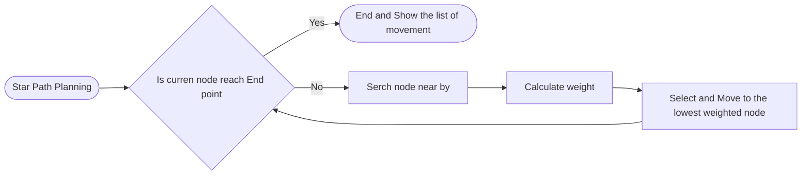

# AAE2004_t1_GP8 Look gooood
<p align='center'>
<image src=images/Group_8_Banner.gif alt="Group 8 Banner">
</p>


<!-- TABLE OF CONTenT-->
<details open='open'>
  <summary><h2 style='display: inline-block'>Table of Content</h2></summary>
  <ol>
    <li>
      <a href='#1--background-of-path-planing-to-aviation-engineering'>Background of Path Planning to Aviation Engeering</a>
    </li>
    <li><a href='#2--theory-of-path-planning-algorithm'>Theory of Path Planning Algorithm</a>
    </li>
    <li><a href='#3--introduction-of-the-engineering-tools'>Introduction of the Engeering Tools</a>
    </li>
    <li>
      <a href='#4--task-1'>Task 1</a>
    </li>
    <li>
      <a href='#5--task-2'>Task 2</a>
    </li>
    <li>
      <a href='#6--task-3'>Task 3</a>
    </li>
    <li><a href='#7--additional-task-1'>Additional Task 1</a>
    </li>
    <li><a href='#8--additional-task-2'>Additional Task 2</a>
    </li>
    <li><a href='#9--additional-task-3'>Additional Task 3</a>
    </li>
    <li><a href='#10--reflective-essay'>Reflective Essay</a>
    </li>
    <li><a href='#11--references'>References</a></li>
    <li>
      <a href='#useful-source'>Useful source</a>
    </li>
    <li>
      <a href='#progess'>Task on progess</a>
    </li>
  </ol>
</details>

<!-- REPORT CONTACT-->


# **1 | Background of Path Planing to Aviation Engineering**


<p>
  &nbsp;&nbsp;&nbsp;&nbsp;In Aviation Industry, Path Planning has a importance place in Air Traffic Control, Airline Companies and Airports. ...
  <br>
  &nbsp;&nbsp;&nbsp;&nbsp;For Air Traffic Control,by calculating obstical and danger zone, Path Planning help operater adjust the flight route of aircrafts, in order to provide a safety flying experience. ...
  <br>
  &nbsp;&nbsp;&nbsp;&nbsp;For Airline Companies, by calculating the shortest route for airlines, Path Planning help companies reduce filght cost, in order to enhance their profit. ...
  <br>
  &nbsp;&nbsp;&nbsp;&nbsp;For Airports, by planning the take off and landing timing, Path Planning help Airports maximize the aircraft flow, in order to increase passenger flow. ...

  <br>
</p>

# **2 | Theory of Path Planning Algorithm**
- [ ] show how its work

&nbsp;&nbsp;&nbsp;&nbsp;Converting a maze problem into a grid format, A-Star algorithm will assign a weight value which repersent the traveling cost on each coordinates. By calculating the lowest traveling cost between start point and end point, a shortest path can be collected.
<br>
Example for a maze problem is fitted into a grid format.

<table align='center'>
  <tr>
    <th>Maze Problem</th>
    <th>Grid Format</th>
  </tr>
  <tr>
    <td>
    <image src='images/Raw_sample.png'>
    </td>
    <td>
      <image src='images/Sample.png' alt='how is work'>
    </td>
  </tr>
</table>
&nbsp;&nbsp;&nbsp;&nbsp;In grid format, all possabale path position are recognized as node, and can be assigned a weight to show the traveling cost, which show as follows.
<br><br>
<b>Step 1</b>, calculate the traveling cost form start point to its adjacent and diagonal notes. Then base on each node, calculate heuristic estimated cost, the displacement, between itself and end point. After combine the traveling cost and heuristic estimated cost, a weight of the node can be obtainted.The data are stored in a list of possable step.<br><br>
<b>Step 2</b>, select the lowest weight node from the list as repersenting the position of the <b>first</b> step apporaching to the End Point. Then append it to a list which recorded evey step it moved to.
<br><br>
<b>Step 3</b>, repeat Step 1 and Step 2 untill it reaches the End point, A list of the movement can be obtained.
<br><br>
<b>Step 4</b>, Track back from the list of movement, a route of shortest path can be viewed.<br><br>
<table align='center'>
  <tr>Diagram of above steps:</tr>
  <tr>
    <td><image src='images/2_step1.png'></td>
    <td><image src='images/2_step2.png'></td>
    <td><image src='images/2_step_3&4.png'></td>
    <td><image src='images/Theory_example.gif'></td>
  </tr>
</table>

Flowchart for A-Star algorithm:<br> 


# **3 | Introduction of the Engineering Tools**

## **A. Python & Html**
&nbsp;&nbsp;&nbsp;&nbsp;Both Python and Html are computer langue which is easy to learn and having a large flexibility. Moreover, Python has diverse of modpack, In this project we uesd Matplotlib and Imageio for graphing and photo operating. 
## **B. Visual Studio Code**
&nbsp;&nbsp;&nbsp;&nbsp;Visual Studio Code(VS Code), is a platform fo source code editing, it covers many useful features, such as debugging, syntax highlighting, intelligent code completion, snippets, code refactoring, and embedded Git. Ferthermore, estension can be install for  additional functionality
## **C. GitHub**
&nbsp;&nbsp;&nbsp;&nbsp;GitHub is a free online platform, for programmer hosting and cooperatiing softwre developmentd. It is not only used to host open source software development projects, but also hold variety of event for instan Game Off.
<!-- TASK 1 -->
# **4 | Task 1**

## a. Methodology
<ol type='I'>
<h3><li>Information</li></h3>
<dd>&nbsp;&nbsp;&nbsp;&nbsp;Although most of the fights do not always follow the same route, it is important for airlines to find the shortest route to reach their destination as it not only saves time but also saves money by decreasing fuel consumption. Additionally, the most efficient aircraft model is selected based on the route that helps minimize the flight cost.In this task, we are going to find the best aircraft models with minimum cost for the shortest route found for the given challenge keeping the needs of passsengers in mind.
<br><br></li>
<h3><li>Data for task 1</h3>
<table align='center'>
  <tr><th>Our map</th><th>Our map in grid format</th></tr>
  <tr>
    <td><image src='images/map.png' width=100%></td>
    <td><image src='images/Map_in_grid.png' width=1500></td>
  </tr>
</table>

<h3>&nbsp;&nbsp;&nbsp;&nbsp;Cost Speciffication</h3>
&nbsp;&nbsp;&nbsp;&nbsp;More cost will be calculated when travelling in the cost intensive area. Extra 20% in Fuel cost intensive area and 40% for Time cost intsnsive area.

| key | A321neo | A330-900neo | A350-900|
| :---: | :---: | :---: | :---: |
|Fuel Consumption rate(kg/min)|54|84|90|
|Passenger Capacity|200|300|350|
|Time cost (Low)($/min)|10|15|20|
|Time cost (Medium)($/min)|15|21|27|
|Time cost (High)($/min)|20|27|34|
|Fixed Cost($)|1800|2000|2500|

<br><h3>&nbsp;&nbsp;&nbsp;&nbsp;Trip cost equation</h3>

$Cost=C_{Fuel} \cdot \Delta F \cdot T_{best} +C_{Time}\cdot T_{best}+C_{Fixed}$

<br>
$C_{fuel}$: fuel cost<br>
$\Delta F$: consumed fuel<br>
$T_{best}$: traveling time (mins)<br>
$C_{Time}$: time cost<br>
$C_{Fixed}$: fixed cost <br>

<h3>Detail of each scenarios</h3>

### &nbsp;&nbsp;&nbsp;&nbsp;Scenario 1
1. 3000 Passengers  with in this week
2. 12 flights maximum per week
3. Time cost = medium and Fuel cost = 0.76$/kg

### &nbsp;&nbsp;&nbsp;&nbsp;Scenario 2 
1. 1250 Passengers  with in this month
2. 5 flights maximum per week
3. Time cost = high and Fuel cost = 0.88$/kg

### &nbsp;&nbsp;&nbsp;&nbsp;Scenario 3
1. 2500 Passengers  with in this week
2. 25 flights maximum per week
3. Time cost = low and Fuel cost = 0.95$/kg

</dd>&nbsp;</li>
<h3><li>Procedure</h3><dd>
&nbsp;&nbsp;&nbsp;&nbsp;The task objective is to find the flight cost for each aircraft in our <b>Map</b>. Then, compare and select the best aircraft models which has minimum cost and with in the limitation.<br><br>
&nbsp;&nbsp;&nbsp;&nbsp;First, create a coresponding obstacle and cost intensive area map in grid format.<br><br>
&nbsp;&nbsp;&nbsp;&nbsp;Second, by applying the map in to A-Star algorithm and starting path planning, a best route with the lowest travelling cost is collected.<br><br>
&nbsp;&nbsp;&nbsp;&nbsp;Third, according to each scenriao, claculate the total cost for 3 different aircrafts.<br><br>
&nbsp;&nbsp;&nbsp;&nbsp;Finally, compare and select an aircraft model that has the lowest travalling cost while satisfying the scenriao.<br>
</dd></li>

## b. Results

<p >
show our result and explain what does the result represent
</p>

## c. Descussion

<p >
Talk about how the task related to aviation
</p>


<!-- Task 2 -->
# **5 | Task 2**
## a. Methodology
<ol type='I'>
<h3><li>Information</h3>
<dd>&nbsp;&nbsp;&nbsp;&nbsp;During path planing, we need to take many variables in count, not only aircraft mode, but also the environment. In reallife there are certain area called Jet Steam Area, where aircrafts could consume reltively less fuel and redust traveling cost. In this task, we are going to recreate a Jet Steam area with a situation that could benefit our flight route the most.
</dd>&nbsp;</li>

<h3><li>Data for Task 2</h3>
<ul>
  The situation:
  <li>Use Task 1 of scenario 1 as the background</li>
  <li>Find a best place for seting the Jet Steam Area</li>
  <li>Cost along the Jet Steam Area is reduced by 5%</li>
  <li>The area of the Jet Steam must span across the map laterally and span 5-unit length vertically
</ul>
<table align='center'>
  <tr><th>Our original map</th><th>Our map with Jet Steam area</th></tr>
  <tr>
    <td><image src='images/map.png' width=100%></td>
    <td><image src='images/Task_2_map.png' width=100%></td>
  </tr>
</table>
</li>
<h3><li>Procedure</h3>
&nbsp;&nbsp;&nbsp;&nbsp;There are 2 major part in our apporach, 'Finding the best place of jet steam area' and 'Cost calculation' .
<h3>1. Finding the best place of jet steam area
</h3>&nbsp;&nbsp;&nbsp;&nbsp;To maximize the effect of jet steam area, we need to find a section(5 continuous y-coordinates) that covered by most of the flight route. 
<h3>2. Cost calculation</h3>&nbsp;&nbsp;&nbsp;&nbsp;A new cost intensive area which decrease 5% cost should be added in the input data. As this task shar the same background of task 1 scenario 1, the calculation for trivaling cost can refre to task 1 scenario 1.

</li>
</ol>

## b. Results

<p align='center'>
show our result and explain what does the result repersent
</p>

## c. Descussion

<p align='center'>
Talk about how the task related to aviation
</p>

## Introduction
- [x] : How the task related to daily aviation

        The area designed in task 2 represents jet-stream area where aircrafts could consume relatively less fuel
        -> reduce the cost of flights
        
- [x] : Task objective

        Recreate a jet-steam area in the map that could most benefit our flight route. 
        
## Content
- [x] : Things to do

        Design a new cost area -> reduce the cost of the route of scenario 1 in task 1
         
- [x] : How and what we have done (explain with result)

        1 Base on the scenario 1 in Task 1
        2 Create a reduce-cost area in the map (size: vertical lengths:5 , horizontal length:infinity [cyan in colour])
        3 Finding the lowest Trip Cost in pothntial.


## Conclusion
- [ ] : result (1 line to cover it)
- [ ] : How to improve
<!-- Task 3 -->

# **6 | Task 3**
## a. Methodology
 
<ol type='I'>
<h3><li>Information</h3>
<dd>&nbsp;&nbsp;&nbsp;&nbsp;Humain invent tools to help them overcome obsticals, as same as aviation industry. In real life, aircraft are designed based on industry needs. In the task, we are going to deesign a new air craft by finding out its parameters based on the restrictions.</dd>&nbsp;</li>
<h3><li>Data for task 3</h3>
<ul> Ruel and Restrictions:
<li>design a new aircraft to best fit Task 1 Scenario 1</li>
<li>Onlr consider cruise time of flight </li>
<li>Also design the passenger capacity of the aircraft<br>(for each 50 passenger (min 100, max 450) increase time cost by 2 $/min (base time cost is 12 $/min))</li>
<li>The base design is a twin-engine aircraft, if capacity>=300, you must switch to a 4-engine aircraft</li>
<li>C<sub>c</sub> = 2000 for twin-engine, 2500 for 4-engine aircrafts</li>
<li>Each engine consumes fuel at 20 kg/min</li>
<li>Follow the trip cost equation and material cost list</li>
</ul>
<h3>&nbsp;&nbsp;&nbsp;&nbsp;Trip cost equation</h3>


$Cost=C_{Fuel} \cdot \Delta F \cdot T_{best} +C_{Time}\cdot T_{best}+C_{Fixed}$
<br>

$C_{fuel}$: fuel cost<br>
$\Delta F$: consumed fuel<br>
$T_{best}$: traveling time (mins)<br>
$C_{Time}$: time cost<br>
$C_{Fixed}$: fixed cost <br><br>


<h3>&nbsp;&nbsp;&nbsp;&nbsp;Fuel cost </h3>

<table>
<tr>
  <td>Fuel Price Analisis<sup>[1]</sup></td>
</tr>
<tr>
  <th>4 Feb 2022</th>
  <th>...</th>
  <th>&nbsp;&nbsp;&nbsp;&nbsp;$/mt&nbsp;&nbsp;&nbsp;&nbsp;</th>
  <th>...</th>
</tr>
<tr>
<td>Jet Fuel Price</td><td>...</td><td>882.30</td><td>...</td>
</tr>
<tr>
<td>...</td><td>...</td><td>...</td><td>...</td>
</tr>
</table>
[1]:<a href='https;//www.iata.org/en/publications/economics/fuel-monitor'>https;//www.iata.org/en/publications/economics/fuel-monitor</a>

<h3><li>Procedure</h3><dd>    
<p align='center'>
explain how to achive and what skills we used

For the way how will achive the goal,we have decsided 3 different model of aircraft with different maximum passenger capacities for comparison.250,300 and 450. Since of the requirement of senerio 1 are transporting 3000 passengers in one week and the maximum number of flight per week is 12,the lowest possible passengers capacity of the aircraft is 250.Therefore,although the requirment mentioned in task 3 is the lowest capacity of a aircraft is 100,we don't use it as our minimum capacity of the aircraft.For what skills we used,we calculated the total cost on our own.According to the equation,we put different data into the equation and we got different outcomes.For example,we use $882.3/mt into the fuel cost and 77.18376541764 minutes as the time in all different models.
</p>
</ol>
## b. Results

<p align='center'>
show our result and explain what does the result repersent

As you can see from the table,The model with 450 passengers as the maximum capacity require $71844 to fulfill the requirment of senerio 1,and the model with 300 and 250 passengers as their maximum capacithy require $98003 and $78064.The model 3 has the lowest total in 3 model.This model reuire 7 trips to transport all 3000 passengers from start point to goal point and model 2 and 1 require 10 and 12 total trips.Although the operating cost of model 3 each flight is the highest in 3 models,the total trips are the lowest.Because the model 2 is also a 4 enginee aircraft,the cost of it's each flight is significantly higher than the model 1.Moreover it's number of total cost is not significantly close to the model 3.Therefore,the number of total trips are the most important element to lower the total cost instead of the cost each flight.For further informations,the name of our 4 enginee aircraft will be P801. P stands for Polyu,(8) stands for our group number and finish the mission with the highest efficiency and takeing the lowest cost and requirment are the meanings of (01)    
</p>

## c. Descussion

<p align='center'>
Talk about how the task related to aviation

Compare to another type of transportation method,the manufacture and the operating cost of an aircraft are in a extremely high level.Besides gaining the profit from the commerical flight,airlines are required to surver the gigantic operating cost from different areas.The operating cost of aircraft in each flight are the biggest outcome of the airlines besides owning a aircraft. There is a significant differences of operating cost to fulfill the requirement between in different mode of maximum passengers capacity to meet the requirement of senerio 1.If the airlines doesn't choose the most efficency mode,there will be planty of unnesscary economic resources are wasted. Therefore,finding the best model to fulfill the requirment in the lowest operating cost to prevent the unnesscary waste are extremely important to the aviation.
</p>

## Introduction
- [ ] : How the task related to daily aviation
- [ ] : Task objective
## Content
- [ ] : Thhings to do
- [ ] : How and What we have done (explain with result)

## Conclusion
- [ ] : result (1 line to cover it)
- [ ] : How to improve
<!-- updates -->

# **7 | Additional Task 1**
## a. Methodology

<p align='center'>
explain how to achive and what skills we used
</p>

## b. Results

<p align='center'>
show our result and explain what does the result repersent
</p>

## c. Descussion

<p align='center'>
Talk about how the task related to aviation
</p>

# **8 | Additional Task 2**
## a. Methodology

<p align='center'>
explain how to achive and what skills we used
</p>

## b. Results

<p align='center'>
show our result and explain what does the result repersent
</p>

## c. Descussion

<p align='center'>
Talk about how the task related to aviation
</p>

# **9 | Additional task 3**
## a. Methodology

<p align='center'>
explain how to achive and what skills we used
</p>

## b. Results

<p align='center'>
show our result and explain what does the result repersent
</p>

## c. Descussion

<p align='center'>
Talk about how the task related to aviation
</p>


# **10 | Reflective Essay**
<h2>Shek Ho Ching Ken (22075211D)</h2>

```
  This project is my first GitHub project in my life ,also ......
```
## Put your Name here (student ID)
```
  Type your essay Here!!!
```

# **11 | References**
-  hi


----
<!-- TASK -->

## Progess  
### Week 8
- [x] familiarize with GitHub and VScode
### Week 9
- [x] finish task 1 by week 11
### Week 10
- [ ] report for Task_1 & Task_2
- [ ] [PowerPoint slide](https://connectpolyu-my.sharepoint.com/:p:/g/personal/22075211d_connect_polyu_hk/Ecv7NPHGFGtBt5Jk1Ql2RFoBYP0CGmmuKWjzxvsIqG_WnA?e=OU8kzx) for video
### week 11
- [ ] [MSWord]("https://connectpolyu-my.sharepoint.com/:w:/g/personal/22075211d_connect_polyu_hk/ESFi3BeMMBBJv2-l2V8ch4wBDD6baR5c8cD08VUSOuKRZA?e=avXK26") report 
- [ ] GitHub report
<!-- REFERCE -->
------
## Useful source

### YouTube video:
[How To Create Beautiful and Useful ReadMe Documents For GitHub](https://youtu.be/a8CwpGARAsQ)

### Web Site
[AAE GitHub Page](https://github.com/IPNL-POLYU/PolyU_AAE2004_Github_Project)

[basic syntax](https://www.markdownguide.org/basic-syntax)

[How to write Methodology](https://www.scribbr.com/dissertation/methodology/)

[A-Star Breakdown](AStar%20Breakdown.docx)
